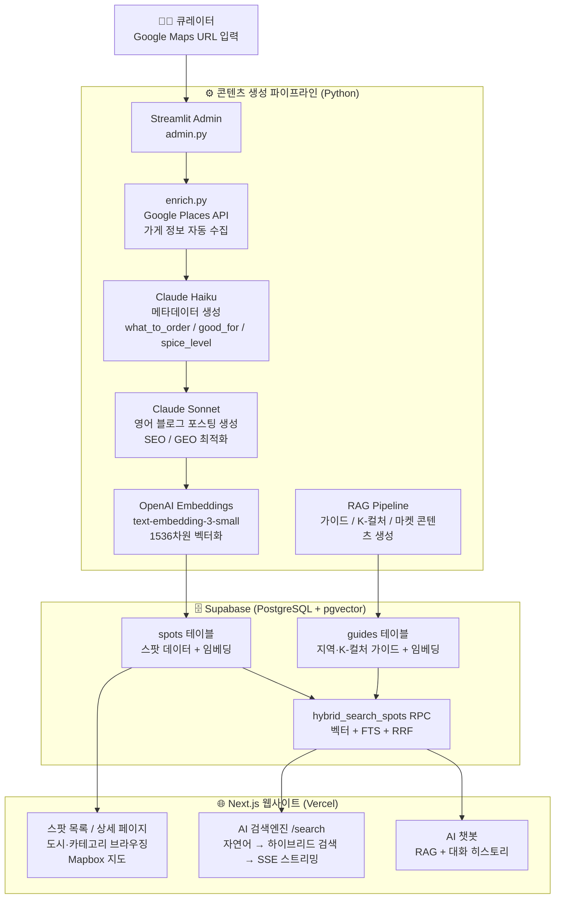

# Bapmap

**한국 로컬 맛집을 외국인 여행자에게 연결하는 AI 큐레이션 플랫폼**

K-컬쳐(K-pop, K-드라마)에 관심 있는 영어권 외국인이 "한국인이 실제로 가는 맛집"을 찾기 어렵다는 문제를 해결한다.
직접 큐레이션한 스팟 데이터를 기반으로 AI가 콘텐츠를 자동 생성하고, RAG 기반 검색엔진과 AI 챗봇으로 여행자가 원하는 맛집을 찾을 수 있게 한다.

---

## 타겟

- 한국 방문 **영어권 외국인 여행자** — K-pop/K-드라마 팬 포함
- 처음 또는 두 번째 한국 방문자

---

## 전체 아키텍처



---

## 기술 스택

### 백엔드 / 파이프라인 (Python)

| 역할 | 도구 |
|------|------|
| 언어 | Python 3.12 |
| 어드민 UI | Streamlit (Streamlit Cloud 배포) |
| 가게 정보 수집 | Google Places API (New) |
| AI 모델 | Claude Haiku 4.5 (메타데이터·쿼리 분류), Claude Sonnet 4.6 (블로그 생성) |
| 임베딩 | OpenAI `text-embedding-3-small` |
| DB 클라이언트 | supabase-py |
| 로마자 변환 | unidecode |

### 데이터베이스 (Supabase)

| 테이블 | 역할 |
|--------|------|
| `spots` | 스팟 데이터 전체 (메타데이터, 콘텐츠, 임베딩 포함) |
| `guides` | 지역별 / K-컬쳐 가이드 (임베딩 포함) |

**Supabase 함수 (RPC)**
- `hybrid_search_spots` — 벡터 검색 + 키워드 검색 RRF 방식으로 결합, 지역/카테고리 필터 지원
- `search_guides` — 벡터 유사도 기반 가이드 검색

**pgvector** 익스텐션으로 1536차원 임베딩 저장 및 코사인 유사도 검색

### 프론트엔드 (Next.js)

| 역할 | 도구 |
|------|------|
| 프레임워크 | Next.js 16 (App Router) |
| 언어 | TypeScript |
| 스타일 | Tailwind CSS v4 |
| 지도 | Mapbox GL |
| 마크다운 렌더링 | react-markdown |
| AI API | Claude Haiku (검색 쿼리 분류·챗), OpenAI (임베딩) |
| DB | @supabase/supabase-js |
| 배포 | Vercel |

---

## 파이프라인 상세

### 1. 스팟 추가 (admin.py)

1. Google Maps URL 입력
2. `pipeline/enrich.py` — URL에서 좌표 파싱 → Google Places API로 가게 정보 조회
   - 이름, 주소, 영업시간, 평점, 리뷰, 이미지, 가격대 등 자동 수집
   - 영어 이름 없으면 `unidecode`로 로마자 변환
3. Supabase `spots` 테이블에 저장

### 2. 메모 작성 (큐레이터)

어드민에서 직접 작성. 작성 기준:
- 대상: 한국을 처음/두 번째 방문하는 영어권 외국인 (K-컬쳐 관심자 많음)
- 톤: 한국 친구가 귀띔해주는 느낌. 솔직하고 구체적
- 내용: "왜 이 집인가" — 비슷한 집들 사이에서 이 집만의 차별점
- K-컬쳐 연결: 아이돌 단골, 드라마 촬영지 등 실제 연관성 있을 때만

### 3. 콘텐츠 생성 (pipeline/generator.py)

**메타데이터 자동 생성** (Claude Haiku):
- `what_to_order`: 추천 메뉴 2~3개
- `good_for`: 태그 (Solo dining, Date night, Budget-friendly 등)
- `spice_level`: 0~3 (AI가 카테고리·리뷰 기반으로 판단)

**블로그 포스팅 자동 생성** (Claude Sonnet):
- 650~850단어 영어 포스팅
- SEO 최적화 (지역명 + 음식종류 키워드 포함)
- GEO 최적화 (Perplexity, ChatGPT 같은 AI 검색엔진 인용 가능하도록 구체적 팩트 포함)
- 현지인 시선 톤 — "nestled", "hidden gem", "must-try" 같은 관광지 클리셰 금지

### 4. 임베딩 (pipeline/rag/embed.py)

- 스팟 텍스트 (이름, 카테고리, 지역, 메모, 콘텐츠) → `text-embedding-3-small` → 1536차원 벡터
- Supabase `spots.embedding` 컬럼에 저장

### 5. 가이드 생성 (pipeline/rag/)

- `generate_guides.py` — 서울 주요 지역별 음식 가이드 (50+ 지역)
- `generate_kculture.py` — K-pop/K-드라마 관련 지역 가이드
- `generate_markets.py` — 전통시장 가이드
- Wikipedia + Google Places 데이터 → Claude Sonnet으로 생성 → 임베딩 후 Supabase 저장

---

## 웹사이트 기능

### AI 검색엔진 (/search)

사용자가 자연어로 검색하면:

1. **쿼리 분류** (Claude Haiku) — 검색어 정제, 지역/카테고리 추출, 의도 파악 (food / culture / both)
2. **임베딩** — OpenAI로 쿼리 벡터화
3. **하이브리드 검색** — `hybrid_search_spots` RPC
   - 벡터 검색 (의미 기반)
   - 키워드 검색 (FTS)
   - RRF(Reciprocal Rank Fusion)로 결합
4. **가이드 검색** — `search_guides`로 관련 지역/K-컬쳐 가이드 조회
5. **답변 스트리밍** (Claude Haiku) — 스팟 + 가이드 컨텍스트 기반으로 SSE 스트리밍 답변
6. **스팟 카드** — 관련 스팟을 오른쪽 패널에 카드로 표시

### AI 챗봇 (우하단 FAB)

- 검색 결과에서 "More →" 클릭 시 기존 검색 Q&A를 첫 턴으로 이어받아 시작
- 또는 FAB 버튼으로 독립적으로 열기
- 질문마다 RAG 검색 (새 컨텍스트 주입) + 대화 히스토리 유지
- 장소 추천 질문엔 스팟 카드 표시, 일반 정보 질문엔 텍스트만
- 한국 음식/여행 외 질문은 차단
- 대화 내용 localStorage에 저장 → 페이지 이동해도 유지

---

## 프로젝트 구조

```
Bapmap/
├── admin.py                      # Streamlit 어드민 앱
├── requirements.txt
│
├── pipeline/
│   ├── enrich.py                 # Google Places API 데이터 수집
│   ├── generator.py              # Claude로 블로그 포스팅·메타데이터 생성
│   ├── re_enrich.py              # 기존 스팟 데이터 재보강
│   ├── fill_metadata.py          # what_to_order/good_for 일괄 채우기
│   └── rag/
│       ├── embed.py              # OpenAI 임베딩 → Supabase 저장
│       ├── generate_guides.py    # 지역별 가이드 생성
│       ├── generate_kculture.py  # K-컬쳐 가이드 생성
│       ├── generate_markets.py   # 전통시장 가이드 생성
│       └── search.py             # 로컬 RAG 검색 유틸
│
└── web/                          # Next.js 웹사이트
    ├── app/
    │   ├── page.tsx              # 홈 (최신 스팟 카드)
    │   ├── spots/
    │   │   ├── page.tsx          # 전체 스팟 목록
    │   │   └── [slug]/page.tsx   # 개별 스팟 상세 페이지
    │   ├── search/page.tsx       # AI 검색엔진 + 챗봇 드로어
    │   ├── map/page.tsx          # Mapbox 지도 뷰
    │   └── api/
    │       ├── search/route.ts   # 검색 API (RAG + 스트리밍)
    │       └── chat/route.ts     # 챗봇 API (RAG + 대화 히스토리)
    └── components/
        └── Header.tsx
```

---

## Supabase spots 테이블 주요 컬럼

| 컬럼 | 타입 | 설명 |
|------|------|------|
| `name` | text | 한국어 가게 이름 |
| `english_name` | text | 영어/로마자 이름 |
| `city` / `region` | text | 도시 / 세부 지역 |
| `category` | text | 음식 카테고리 |
| `address` | text | 한국어 주소 |
| `lat` / `lng` | float | 좌표 |
| `google_maps_url` | text | 구글 맵스 링크 |
| `rating` / `rating_count` | float / int | 구글 평점 |
| `image_url` / `image_urls` | text / jsonb | 이미지 |
| `google_reviews` | jsonb | 구글 리뷰 샘플 |
| `memo` | text | 큐레이터 노트 (추천 이유) |
| `what_to_order` | jsonb | 추천 메뉴 (AI 생성) |
| `good_for` | jsonb | 태그 (AI 생성) |
| `spice_level` | int | 매운 정도 0~3 (AI 판단) |
| `content` | text | 영어 블로그 포스팅 (AI 생성) |
| `embedding` | vector(1536) | OpenAI 임베딩 |
| `status` | text | 메모필요 / 메모완료 / 업로드완료 |

---

## 환경 변수

```env
# Python (admin + pipeline)
ANTHROPIC_API_KEY=
OPENAI_API_KEY=
SUPABASE_URL=
SUPABASE_SERVICE_KEY=
GOOGLE_PLACES_API_KEY=

# Next.js (web/.env.local)
ANTHROPIC_API_KEY=
OPENAI_API_KEY=
NEXT_PUBLIC_SUPABASE_URL=
SUPABASE_SERVICE_KEY=
NEXT_PUBLIC_MAPBOX_TOKEN=
```

---

## 실행 방법

```bash
# 어드민 앱
pip install -r requirements.txt
streamlit run admin.py

# 임베딩 누락분 채우기
python -m pipeline.rag.embed --missing

# 지역 가이드 생성
python -m pipeline.rag.generate_guides

# 웹 개발 서버
cd web && npm install && npm run dev
```

---

## 수익 모델

| 단계 | 방식 |
|------|------|
| 초기 | Google AdSense (트래픽 기반 광고) |
| 성장 | 제휴 마케팅 (예약 플랫폼, 투어 상품) |
| 확장 | 스폰서드 콘텐츠, B2B 데이터 제공 |
